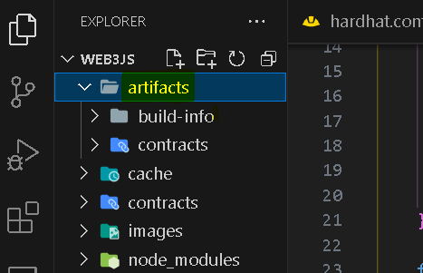

# Using Web3 With Hardhat

## Introduction

Following the recent compatibility update of Hardhat plugin [hardhat-web3-v4](https://hardhat.org/hardhat-runner/plugins/nomicfoundation-hardhat-web3-v4), `Web3.Js` is now available to use as plugin in Hardhat.

This tutorial will guide you through using Web3js as a plugin to interact with the Blockchain.

:::info
This tutorial explains how to create a Web3.js + Hardhat project from scratch. The [`create-hardhat-web3`](https://github.com/web3/hardhat-web3) command line utility was created to automate many of the steps in this tutorial and make it easier to quickly bootstrap a new Web3.js + Hardhat project.
:::

## Pre-requisite

This tutorial assumes you have previous knowledge of writing Smart contracts, and are convenient working with JavaScript/TypeScript. You should have [NodeJS](https://nodejs.org/en) version greater than v16 installed.

:::note
To install dependencies, we will use `NPM`.
:::

## Steps

-   [Initiate a Hardhat project](#initiate-a-hardhat-project)
-   [Install required dependencies (including `hardhat-web3-v4`)](#install-required-dependencies-including-hardhat-web3-v4)
-   [Write the Smart Contract](#write-the-smart-contract)
-   [Compile and deploying the contract](#compile-test-and-deploy-the-contract)
-   [Testing and interacting with the contract](#testing-and-interacting-with-the-contract)

### Initiate a Hardhat project

Create a new project folder and navigate into it.

```bash
mkdir myproject
```

```bash
cd myproject
```

Install and instantiate Hardhat in the current project.

```bash
npm install hardhat
```

```bash
npx hardhat init
```


### Install required dependencies (including `hardhat-web3-v4`)

Select `TypeScript` and `Yes` for the rest of the options.
You will be prompted to install the required dependencies. Reply `yes` to complete the installation.
To include the `Hardhat-web3-v4` plugin, we will install it via `npm`.

```bash
npm install --save-dev @nomicfoundation/hardhat-web3-v4 'web3@4'
```

This will add Web3.Js to your project by including it in the 'node_modules' folder. To extend the Hardhat functionality with this plugin, we have to import the `web3-v4 plugin` in the Hardhat configuration file `hardhat.config.ts`. Import this at the top of the config file.

```ts
import { HardhatUserConfig } from 'hardhat/config';
import '@nomicfoundation/hardhat-toolbox';
import '@nomicfoundation/hardhat-web3-v4'; // <================

const config: HardhatUserConfig = {
	solidity: '0.8.19',
};

export default config;
```

By default, `hardhat-toolbox` is added to the file. You will need to explicitly invoke the plugin. This will modify the Hardhat Run-time Environment - HRE and to include both the Web3 class and an instantiated web3 object. With the latter, you get a modified ready-to-use web3 object can comes with an initialized local/Hardhat provider. The object will be available to use anywhere in the project such as testing and deployment files.

### Write the Smart Contract

When you start a new project, Hardhat provides a sample `Lock` contracts. Please refer to the contract in `myproject/contracts/Lock.sol` file.

```ts
  // SPDX-License-Identifier: UNLICENSED
  pragma solidity ^0.8.9;

  // Uncomment this line to use console.log
  // import "hardhat/console.sol";

  contract Lock {
    uint public unlockTime;
    address payable public owner;

    event Withdrawal(uint amount, uint when);

    constructor(uint _unlockTime) payable {
      require(
        block.timestamp < _unlockTime,
        "Unlock time should be in the future"
      );

      unlockTime = _unlockTime;
      owner = payable(msg.sender);
    }

    function withdraw() public {
      // Uncomment this line, and the import of "hardhat/console.sol", to print a log in your terminal
      // console.log("Unlock time is %o and block timestamp is %o", unlockTime, block.timestamp);

      require(block.timestamp >= unlockTime, "You can't withdraw yet");
      require(msg.sender == owner, "You aren't the owner");

      emit Withdrawal(address(this).balance, block.timestamp);

      owner.transfer(address(this).balance);
    }
  }

```

`Lock.sol` is a simple timeLock contract capable of accepting any amount of `Ether` at deployment while expecting one parameter that will be assigned to a state variable when deployed. The `withdraw` function allows only the address marked as `owner` to withdraw the total contract balance only if the 'unlockTime' is not in the future.

### Compile, test and deploy the contract

-   Compile and deploying the contract

```bash
npx hardhat compile
```

Running the above command will generate a folder called `artifacts` containing the build information and the compiled contracts. From this directory, we will require the jasonInterface otherwise called the Application Binary Interface - ABI during testing and deployment.



To deploy the contract, we will modify the `script/deploy.ts` file as shown below.

First, we import the initialized web3 object from hardhat. Next we get the artifacts.

```ts
import { web3 } from 'hardhat';
import artifacts from '../artifacts/contracts/Lock.sol/Lock.json';

async function main() {}

// We recommend this pattern to be able to use async/await everywhere
// and properly handle errors.
main().catch(error => {
	console.error(error);
	process.exitCode = 1;
});
```

Inside the main function, we prepare the deployment using a few of the web3.Js functionalities such as the `.utils` and `.eth` modules.

```ts
async function main() {
	const currentTimestampInSeconds = Math.round(Date.now() / 1000);
	const unlockTime = currentTimestampInSeconds + 60;

	const lockedAmount = web3.utils.toWei('0.001', 'ether');

	const [deployer] = await web3.eth.getAccounts();
	const lockContract = new web3.eth.Contract(artifacts.abi);
	const rawContract = lockContract.deploy({
		data: artifacts.bytecode,
		arguments: [unlockTime],
	});

	const lock = await rawContract.send({
		from: deployer,
		gasPrice: '10000000000',
		value: lockedAmount.toString(),
	});

	console.log(
		`Lock with ${web3.utils.toWei(
			lockedAmount,
			'ether',
		)}ETH and unlock timestamp ${unlockTime} deployed to ${lock.options.address}`,
	);
}

// We recommend this pattern to be able to use async/await everywhere
// and properly handle errors.
main().catch(error => {
	console.error(error);
	process.exitCode = 1;
});
```

Running the following command will deploy the `Lock` contract to a local Blockchain built into Hardhat. We use Web3.Js to talk to the Blockchain to broadcast our smart contract data to the network.

```bash
npx hardhat run scripts/deploy.ts
```

### Testing and interacting with the contract

In the previous steps, we compiled and deployed the contract to the local Blockchain network. It's time to test our contract ensuring it performs as expected. Since we used Web3.Js to talk to the Blockchain to broadcast and save our data, we will use same protocol to view and modify the data.

In the `myproject/test/Lock.ts` file, replace the content with the code below.

```ts
import { time, loadFixture } from '@nomicfoundation/hardhat-toolbox/network-helpers';
import { expect } from 'chai';
import { web3 } from 'hardhat';
import artifacts from '../artifacts/contracts/Lock.sol/Lock.json';

describe('Lock', function () {
	async function deployOneYearLockFixture() {
		const ONE_YEAR_IN_SECS = 365 * 24 * 60 * 60;
		const ONE_GWEI = 1_000_000_000;

		const lockedAmount = ONE_GWEI;
		const unlockTime = (await time.latest()) + ONE_YEAR_IN_SECS;

		const lockContract = new web3.eth.Contract(artifacts.abi);
		lockContract.handleRevert = true;

		const [deployer, otherAccount] = await web3.eth.getAccounts();
		const rawContract = lockContract.deploy({
			data: artifacts.bytecode,
			arguments: [unlockTime],
		});

		// To know how much gas will be consumed, we can estimate it first.
		const estimateGas = await rawContract.estimateGas({
			from: deployer,
			value: lockedAmount.toString(),
		});

		const lock = await rawContract.send({
			from: deployer,
			gas: estimateGas.toString(),
			gasPrice: '10000000000',
			value: lockedAmount.toString(),
		});

		console.log('Lock contract deployed to: ', lock.options.address);
		return { lock, unlockTime, lockedAmount, deployer, otherAccount, rawContract };
	}

	describe('Deployment', function () {
		it('Should set the right unlockTime', async function () {
			const { lock, unlockTime } = await loadFixture(deployOneYearLockFixture);
			const setTime = await lock.methods.unlockTime().call();
			console.log('SetTime', setTime);
			expect(setTime).to.equal(unlockTime);
		});

		it('Should set the right deployer', async function () {
			const { lock, deployer } = await loadFixture(deployOneYearLockFixture);

			expect(await lock.methods.owner().call()).to.equal(deployer);
		});

		it('Should receive and store the funds to lock', async function () {
			const { lock, lockedAmount } = await loadFixture(deployOneYearLockFixture);
			const balance = await web3.eth.getBalance(String(lock.options.address));
			expect(balance).to.equal(lockedAmount);
		});

		it("Shouldn't fail if the unlockTime has arrived and the deployer calls it", async function () {
			const { lock, unlockTime, deployer } = await loadFixture(deployOneYearLockFixture);

			await time.increaseTo(unlockTime);
			await expect(lock.methods.withdraw().send({ from: deployer })).not.to.be.reverted;
		});
	});
});
```

in this file, we performed similar steps as in the deployment script to prepare and deploy the contract using the `ABI` and `bytecode` in `deployOneYearLockFixture()`. To read the `owner` data from the Blockchain, we used an instance of the deployed contract i.e `lock.methods.owner().call().`Invoking `.call()` does not change the state of the blockchain hence no wallet signature is required.

To change the status of the data we previously saved, we have to access the `method` container for the function (s) we desire and invoke the `.send` to broadcast our intention to the network `lock.methods.withdraw().send({from: deployer})`.

:::note
When using `.send()`, you must explicitly provide the `sender` of the transaction in the `from` field (in the above example is the address of the `deployer` account).
:::

To run the test you can use the command

```bash
npx hardhat test test/Lock.ts
```

And you'll get a similar result to this:

```js
/*
Lock
    Deployment
Lock contract deployed to:  0x5FbDB2315678afecb367f032d93F642f64180aa3
SetTime 1739193193n
      ✔ Should set the right unlockTime (884ms)
      ✔ Should set the right deployer (54ms)
      ✔ Should receive and store the funds to lock
      ✔ Shouldn't fail if the unlockTime has arrived and the deployer calls it
*/
```
