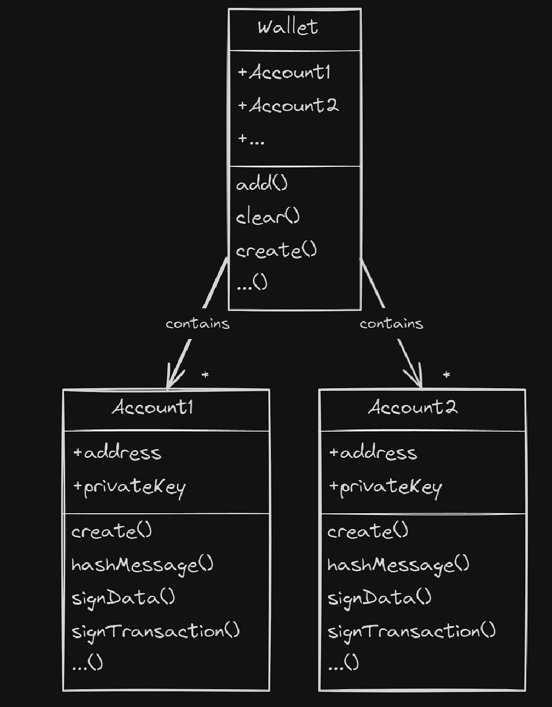

# Wallets and Accounts Overview

## Introduction

A Web3.js `Wallet` is your main entry point if you want to use a private key directly to do any blockchain operations (transactions), also called `Signer` in other libraries.

Unlike other libraries where a wallet holds just one account, a Web3.js `Wallet` can handle **multiple accounts**. They each have their private key and address. So, whether those keys are in your computer's memory or protected by MetaMask, the Wallet makes Ethereum tasks secure and simple.

The `web3-eth-accounts` package contains functions to generate Ethereum accounts and sign transactions and data.

In Ethereum, a private key is a critical part of the cryptographic key pair used to secure and control ownership of Ethereum addresses. Each Ethereum address has a matching set of public and private keys in a public-key cryptography system. This key pair enables you to own an Ethereum address, manage funds, and initiate transactions.

Learn more about wallets [here](https://ethereum.org/en/wallets/)

You can sign and send transactions in different ways.

-   [Local wallet](./local_wallet) **(Highly recommended)**
-   [Node Wallet](./node_wallet) **(Deprecated)**

For each of them you can use [Web3PromiEvent](./promi_event) to catch extra transaction's events.

## Wallets vs Accounts

An **account** in web3.js is an `object`, it refers to an individual Ethereum address with its associated public and private keys. While a wallet is a higher-level construct for managing multiple accounts, an individual Ethereum address is considered an account.

```ts title='Create a new account'
const account = web3.eth.accounts.create();

console.log(account)
/* ↳ 
{
  address: '0x9E82491d1978217d631a3b467BF912933F54788f',
  privateKey: '0x4651f9c219fc6401fe0b3f82129467c717012287ccb61950d2a8ede0687857ba',
  signTransaction: [Function: signTransaction],
  sign: [Function: sign],
  encrypt: [Function: encrypt]
}
*/
```

A **wallet** in web3.js is an `array` that holds multiple Ethereum accounts. It provides a convenient way to manage and interact with a collection of accounts. Think of it as a digital wallet that you use to store and organize your various Ethereum addresses.

```ts title='Create a new wallet'
//create a wallet with `1` random account
const wallet = web3.eth.accounts.wallet.create(1);

console.log(wallet)
/* ↳ 
Wallet(1) [
  {
    address: '0xB2D5647C03F36cA54f7d783b6Fa5afED297330d4',
    privateKey: '0x7b907534ec13b19c67c2a738fdaa69014298c71f2221d7e5dec280232e996610',
    signTransaction: [Function: signTransaction],
    sign: [Function: sign],
    encrypt: [Function: encrypt]
  },
  _accountProvider: {
    create: [Function: createWithContext],
    privateKeyToAccount: [Function: privateKeyToAccountWithContext],
    decrypt: [Function: decryptWithContext]
  },
  _addressMap: Map(1) { '0xb2d5647c03f36ca54f7d783b6fa5afed297330d4' => 0 },
  _defaultKeyName: 'web3js_wallet'
]
*/
```

## Diagram



To learn more about the `accounts` methods, please visit [web3.js accounts API](/libdocs/Accounts)

To learn more about the `wallet` methods, please visit [web3.js wallet API](/libdocs/Wallet)

## Sending transactions

The shortest way to do this, is by creating a `Wallet` directly by adding a private key (the private key must start with '0x' and it must have funds to execute the transaction)

```ts title='Sending a transaction adding a privateKey'
import { Web3 } from 'web3';

const web3 = new Web3('https://ethereum-sepolia.publicnode.com');

//this will create an array `Wallet` with 1 account with this privateKey
//it will generate automatically a public key for it
//make sure you have funds in this accounts
//highlight-next-line
const wallet = web3.eth.accounts.wallet.add('0x152c39c430806985e4dc16fa1d7d87f90a7a1d0a6b3f17efe5158086815652e5');

const _to = '0xc7203efeb54846c149f2c79b715a8927f7334e74';
const _value = '1'; //1 wei

//the `from` address in the transaction must match the address stored in our `Wallet` array
//that's why we explicitly access it using `wallet[0].address` to ensure accuracy
const receipt = await web3.eth.sendTransaction({
  from: wallet[0].address,
  to: _to,
  value: _value,
});
//if you have more than 1 account, you can change the address by accessing to another account
//e.g, `from: wallet[1].address`

console.log('Tx receipt:', receipt);
/* ↳
Tx receipt: {
  blockHash: '0xa43b43b6e13ba47f2283b4afc15271ba07d1bba0430bd0c430f770ba7c98d054',
  blockNumber: 4960689n,
  cumulativeGasUsed: 7055436n,
  effectiveGasPrice: 51964659212n,
  from: '0xa3286628134bad128faeef82f44e99aa64085c94',
  gasUsed: 21000n,
  logs: [],
  logsBloom: '0x00000...00000000',
  status: 1n,
  to: '0xc7203efeb54846c149f2c79b715a8927f7334e74',
  transactionHash: '0xb88f3f300f1a168beb3a687abc2d14c389ac9709f18b768c90792c7faef0de7c',
  transactionIndex: 41n,
  type: 2n
}
*/
```

## Interacting with contracts

### Writing functions

To interact with functions that modify or update data in smart contracts(writing-functions), we need to create a `Wallet`. This `Wallet` must holds at least 1 account with the necessary funds to execute these operations on the blockchain.

```ts title='Interacting with writing-functions of a smart contract'
import { Web3 } from 'web3';

const web3 = new Web3('https://ethereum-sepolia.publicnode.com');

//create a wallet
//highlight-next-line
const wallet = web3.eth.accounts.wallet.add('0x152c39c430806985e4dc16fa1d7d87f90a7a1d0a6b3f17efe5158086815652e5');

//this is how we can access to the first account of the wallet
console.log('Account 1:', wallet[0]);
/* ↳
Account 1: {
  address: '0x57CaabD59a5436F0F1b2B191b1d070e58E6449AE',
  privateKey: '0x152c39c430806985e4dc16fa1d7d87f90a7a1d0a6b3f17efe5158086815652e5',
  ...
}
*/

//instantiate the contract
const myContract = new web3.eth.Contract(ABI, CONTRACT_ADDRESS);

//interact with the contract
//wallet[0].address == '0x57CaabD59a5436F0F1b2B191b1d070e58E6449AE'
//highlight-next-line
const txReceipt = await myContract.methods.doSomething().send({ from: wallet[0].address });

console.log('Transaction receipt:', txReceipt);
/* ↳
  Transaction receipt: {...}
*/
```

### Reading functions (view)

To interact with smart contracts `view public/external returns`, we don't need to instantiate a `Wallet`, we can do it just by instantiating the smart contract and the provider.

```ts title='Interacting with reading-functions of a smart contract'
import { Web3 } from 'web3';

//instantiate the provider
const web3 = new Web3('https://ethereum-sepolia.publicnode.com');

//instantiate the contract
const myContract = new web3.eth.Contract(ABI, CONTRACT_ADDRESS);

//call the `view function` in the contract
//highlight-next-line
const result = await myContract.methods.doSomething().call();

console.log('Result:', result)
/* ↳
  Result: ...
*/
```

## Wallet methods

The following is a list of `Wallet` [methods](/libdocs/Wallet) in the `web3.eth.accounts.wallet` package with description and example usage: 

- [add](/libdocs/Wallet#add)
- [clear](/libdocs/Wallet#clear)
- [create](/libdocs/Wallet#create)
- [decrypt](/libdocs/Wallet#decrypt)
- [encrypt](/libdocs/Wallet#encrypt)
- [get](/libdocs/Wallet#get)
- [load](/libdocs/Wallet#load)
- [remove](/libdocs/Wallet#remove)
- [save](/libdocs/Wallet#save)
- [getStorage](/libdocs/Wallet#getStorage) 

## Account methods

The following is a list of `Accounts` [methods](/libdocs/Wallet) in the `web3.eth.accounts` package with description and example usage: 

- [create](/libdocs/Accounts#create)
- [decrypt](/libdocs/Accounts#decrypt)
- [encrypt](/libdocs/Accounts#encrypt)
- [hashMessage](/libdocs/Accounts#hashMessage)
- [parseAndValidatePrivateKey](/libdocs/Accounts#libdocs/Accounts#parseandvalidateprivatekey)
- [privateKeyToAccount](/libdocs/Accounts#privatekeytoaccount)
- [privateKeyToAddress](/libdocs/Accounts#privatekeytoaddress)
- [privateKeyToPublicKey](/libdocs/Accounts#privatekeytopublickey)
- [recover](/libdocs/Accounts#recover)
- [recoverTransaction](/libdocs/Accounts#recovertransaction)
- [sign](/libdocs/Accounts#sign)
- [signTransaction](/libdocs/Accounts#signtransaction)